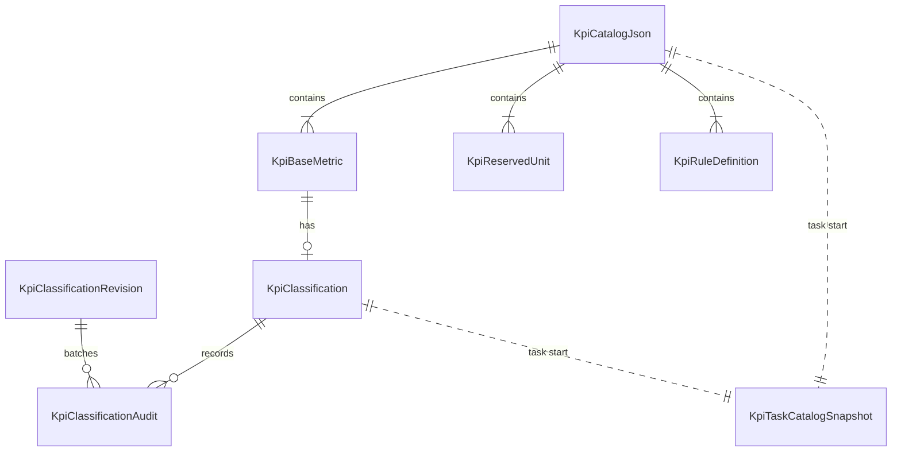

# 数据模型：KPI 基础数据入库与分类状态存储

## 实体关系

## KpiCatalogJson

单一 Git 文件聚合实体。

- `schema_version = 1`
- `source_csv_sha256`：原始资源 CSV 字节摘要。
- `metrics[]`
- `units[]`
- `rules{}`
- 派生属性：`base_data_version = sha256(file_bytes)`，不持久化在文件中。

不变式：

- 所有 key 唯一。
- `unit_key` 当前为 `null`。
- 所有规则引用的 metric key 必须存在。
- 无公式循环依赖。
- 相同 CSV 与相同规则输入产生字节一致的文件。

## KpiBaseMetric

基础指标定义。

| 字段 | 类型 | 约束 |
| --- | --- | --- |
| `resource_id` | string | `ME_*` |
| `key` | string | 小写资源 ID，全局唯一 |
| `name_zh` | string | 非空原文 |
| `name_en` | string | 非空 |
| `unit_key` | null | 当前预留 |

状态：`effective` / `removed_from_base`（后一状态不写回 Git，只由数据库分类记录与基础数据差异派生）。

## KpiReservedUnit

预留单位字典。

| 字段 | 类型 | 约束 |
| --- | --- | --- |
| `resource_id` | string | `UNIT_*` |
| `key` | string | 全局唯一 |
| `name_zh` | string | 非空 |
| `name_en` | string | 非空 |

不与基础指标建立关系，不进入有效目录或任务快照 `metrics`。

## KpiClassification

数据库持久化的当前分类状态。

| 字段 | 类型 | 约束 |
| --- | --- | --- |
| `metric_key` | string | 主键；可指向当前不存在的基础指标 |
| `domain` | string \| null | `call/api/media`；`NULL` 表示未分类 |
| `created_at` | datetime | UTC |
| `updated_at` | datetime | UTC |

不变式：

- 同一 metric key 最多一行。
- 同一任务组合时最多一个有效业务域。
- 删除基础指标不物理删除记录。
- 基础指标恢复后复用既有状态。

状态转换：

- `NULL -> call/api/media`：分类。
- `call/api/media -> NULL`：取消分类；引用保护通过时允许。
- `call/api/media -> call/api/media`：换域；引用保护通过时允许。
- `removed_from_base -> effective`：基础数据恢复后复用。
- `effective -> removed_from_base`：基础数据移除后记录失效。

## KpiClassificationRevision

全局修订单行表。

| 字段 | 类型 | 约束 |
| --- | --- | --- |
| `id` | integer | 固定 `1` |
| `revision` | integer | 从 `0` 递增 |
| `updated_at` | datetime | UTC |

每次成功分类请求递增一次；失败请求不递增。分类修订不作为并发乐观锁输入。

## KpiClassificationAudit

分类审计流水。

| 字段 | 类型 | 约束 |
| --- | --- | --- |
| `id` | integer | 自增主键 |
| `metric_key` | string | 目标指标 |
| `operation` | string | `classify` 或 `unclassify` |
| `operator` | string | API 显式传入；CLI 固定 `cli` |
| `previous_domain` | string \| null | 操作前状态 |
| `next_domain` | string \| null | 操作后状态 |
| `result` | string | 成功操作为 `success` |
| `detail` | object \| null | 批次、来源、修订号等补充 |
| `operated_at` | datetime | UTC |

审计只在成功事务中写入；失败整批回滚。

## EffectiveKpiMetric

运行时组合结果，不直接持久化为通用状态。

| 字段 | 来源 | 说明 |
| --- | --- | --- |
| `key` | base | 稳定 key |
| `resource_id` | base | 原始资源 ID |
| `name_zh` / `name_en` | base | 展示名 |
| `domain` | db | `call/api/media` |
| `rule` | git | 当前指标规则定义 |

只有 `domain != NULL` 且基础数据存在时进入有效目录。未分类指标可由巡检结果作为 `metric_not_registered` 或待分类线索展示，但不进入领域规则。

## KpiTaskCatalogSnapshot

任务级不可变快照。

| 字段 | 类型 | 约束 |
| --- | --- | --- |
| `schema_version` | integer | `1` |
| `base_data_version` | string | 文件 SHA-256 |
| `classification_version` | integer | 数据库递增修订 |
| `captured_at` | datetime | UTC |
| `metrics[]` | array | 完整有效指标与规则 |
| `rules{}` | object | 完整规则定义 |

不变式：

- 单任务只维护一份。
- 单规则重跑优先复用。
- 后续配置变化不重写。
- 不作为新任务的分类状态回退源。

## 引用保护

被以下规则引用的指标，一旦已有业务域分类，不能修改分类：

- 公式 numerator / denominator / fallback inputs。
- 阈值 `metric_key`。
- 容量规则 `metric_key`。

展示规则属于展示配置，不阻止分类变更。引用保护基于当前 Git 规则定义执行；引用被人工移除并提交后，指标恢复可改。
