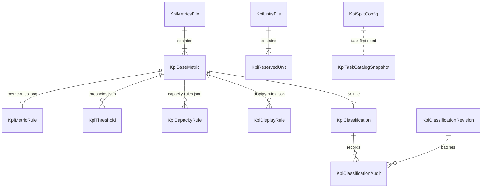

# 数据模型：KPI 基础数据管理

## 总览

权威基础数据由七个固定 JSON 文件组成，Git 是这些文件的权威来源。SQLite 继续保存业务域分类状态、修订单和审计。任务快照保存在任务输出现场。



## 配置目录

```text
deploy/data/kpi/
  base/
    metrics.json
    units.json

  rules/
    common.json
    metric-rules.json
    thresholds.json
    capacity-rules.json
    display-rules.json
```

不变式：

- 所有文件使用 UTF-8、LF 和缩进 2 的确定性 JSON。
- 任意文件缺失、未知字段、重复字段、类型错误或引用错误都会导致目录加载失败。
- 一次性迁移后不再存在权威的 `deploy/data/kpi_catalog.json`。
- 不新增用户维护的配置版本字段。

## KpiMetricsFile

路径：`deploy/data/kpi/base/metrics.json`。

```json
{
  "schema_version": 1,
  "source_csv_sha256": "0123456789abcdef0123456789abcdef0123456789abcdef0123456789abcdef",
  "metrics": []
}
```

| 字段 | 类型 | 约束 |
| --- | --- | --- |
| `schema_version` | integer | 当前只支持 `1` |
| `source_csv_sha256` | string | 最近一次生成基础指标的资源 CSV SHA-256 |
| `metrics` | array | 可为空；元素见 `KpiBaseMetric` |

`source_csv_sha256` 是离线导入溯源信息，不是用户维护的版本。

## KpiUnitsFile

路径：`deploy/data/kpi/base/units.json`。

```json
{
  "schema_version": 1,
  "units": []
}
```

| 字段 | 类型 | 约束 |
| --- | --- | --- |
| `schema_version` | integer | 当前只支持 `1` |
| `units` | array | 可为空；元素见 `KpiReservedUnit` |

## KpiBaseMetric

| 字段 | 类型 | 约束 |
| --- | --- | --- |
| `resource_id` | string | 匹配 `ME_[A-Za-z0-9_]+` |
| `key` | string | `resource_id.lower()`，与单位 key 合并后全局唯一 |
| `name_zh` | string | 非空 |
| `name_en` | string | 非空 |
| `unit_key` | string \| null | 当前必须是 `null` |

不变式：

- 同一文件内 `resource_id` 和 `key` 唯一。
- 与 `units.json` 的 `resource_id` 和 `key` 全局唯一。
- `name_zh` 不承担单位语义；单位后续只能通过 `unit_key` 预留关联。
- CSV 导入完整替换该文件数组，不会自动生成规则。

## KpiReservedUnit

| 字段 | 类型 | 约束 |
| --- | --- | --- |
| `resource_id` | string | 匹配 `UNIT_[A-Za-z0-9_]+` |
| `key` | string | `resource_id.lower()`，与指标 key 合并后全局唯一 |
| `name_zh` | string | 非空 |
| `name_en` | string | 非空 |

不变式：

- 单位只登记，不参与单位换算、单位校验或阈值判断。
- 当前不要求任何指标引用单位。
- `ME_*` 指标名称中不解析括号单位。

## KpiCommonRuleFile

路径：`deploy/data/kpi/rules/common.json`。

```json
{
  "schema_version": 1,
  "input_timezone": "Asia/Shanghai",
  "budgets": {
    "max_files": 1000,
    "max_records": 200000
  }
}
```

| 字段 | 类型 | 约束 |
| --- | --- | --- |
| `schema_version` | integer | 当前只支持 `1` |
| `input_timezone` | string | IANA 时区 |
| `budgets.max_files` | integer | 正整数 |
| `budgets.max_records` | integer | 正整数 |

## KpiMetricRulesFile

路径：`deploy/data/kpi/rules/metric-rules.json`。

```json
{
  "schema_version": 1,
  "metric_rules": []
}
```

每条 `KpiMetricRule` 继续沿用既有字段：

| 字段 | 类型 | 约束 |
| --- | --- | --- |
| `key` | string | 必须存在于 `metrics.json` |
| `metric_type` | string | `count/rate/capacity/latency/gauge` |
| `semantic_group` | string | 非空 |
| `display_role` | string | `highlight/context` |
| `unit` | string | 当前只是展示文本，不做单位校验 |
| `source_type` | string | `raw/derived` |
| `aggregation` | object | `sum/max/percentile/ratio_from_inputs/last` |
| `formula` | object \| null | 派生公式；引用必须存在且无循环 |

不变式：

- `metric_rules[].key` 唯一。
- `raw` 指标不得带公式；`derived` 指标必须带公式。
- 公式 `numerator`、`denominator` 和 fallback inputs 必须引用基础指标。
- 公式依赖图必须无环。

## KpiThresholdsFile

路径：`deploy/data/kpi/rules/thresholds.json`。

```json
{
  "schema_version": 1,
  "thresholds": []
}
```

每条阈值字段继续沿用现有契约：

- `domain`：`call/api/media`
- `metric_key`：必须存在于 `metrics.json`
- `label`：非空
- `direction`：`min/max`
- `unit`：非空展示文本
- `default`：数字
- `periods`：key 只允许 `5/15/30/60`

不变式：同一 `domain + metric_key` 只能有一条阈值。

## KpiCapacityRulesFile

路径：`deploy/data/kpi/rules/capacity-rules.json`。

```json
{
  "schema_version": 1,
  "capacity_rules": []
}
```

每条容量规则字段继续沿用现有契约：

- `source_name`：全局唯一源列名
- `metric_key`：必须存在于 `metrics.json`
- `semantics`：`confirmed` 时为 `peak/concurrency/gauge`，`unknown` 时为 `null`
- `status`：`confirmed/unknown`
- `domain`：`null` 或 `call/api/media`

## KpiDisplayRulesFile

路径：`deploy/data/kpi/rules/display-rules.json`。

```json
{
  "schema_version": 1,
  "display_rules": []
}
```

每条展示规则包含：

- `domain`：`call/api/media`
- `metric_key`：必须存在于 `metrics.json`
- `role`：`highlight/context`

不变式：同一 `domain + metric_key` 只能有一条展示规则。

## 聚合后的 KpiSplitConfig

运行时不改变 `KpiGitCatalog` 的领域概念；`load_kpi_catalog()` 从目录读取并聚合成同一内存对象：

| 属性 | 来源 |
| --- | --- |
| `schema_version` | 固定 `1` |
| `source_csv_sha256` | `base/metrics.json` |
| `metrics` | `base/metrics.json` |
| `units` | `base/units.json` |
| `rules.common` | `rules/common.json` |
| `rules.metric_rules` | `rules/metric-rules.json` |
| `rules.thresholds` | `rules/thresholds.json` |
| `rules.capacity_rules` | `rules/capacity-rules.json` |
| `rules.display_rules` | `rules/display-rules.json` |
| `base_data_version` | 派生的配置集内容指纹 |

`base_data_version` 的计算输入是相对路径和文件字节组成的确定性列表。它不是用户维护的版本，仅保留为既有契约字段和诊断字段。

## KpiTaskCatalogSnapshot

路径：`output/<task_id>/kpi/kpi_catalog_snapshot.json`。

快照契约不变：

| 字段 | 说明 |
| --- | --- |
| `schema_version` | 当前 `1` |
| `base_data_version` | 生成快照时的拆分配置集内容指纹 |
| `classification_version` | 生成快照时的业务域分类修订 |
| `captured_at` | UTC 捕获时间 |
| `metrics[]` | 当时进入业务域的完整有效指标与规则 |
| `rules` | 当时的完整规则集合 |

不变式：

- 新任务首次需要 KPI 配置时生成一次。
- 已有有效快照不被配置变化或重跑覆盖。
- 指定规则重跑遇到快照缺失必须失败。
- 不作为新任务的配置回退来源。

## SQLite 实体

以下实体保持不变：

- `KpiClassification`：当前业务域分类状态。
- `KpiClassificationRevision`：全局分类修订。
- `KpiClassificationAudit`：分类操作审计。

分类修订只用于内部变更追踪和快照记录，不作为用户理解的配置版本。
